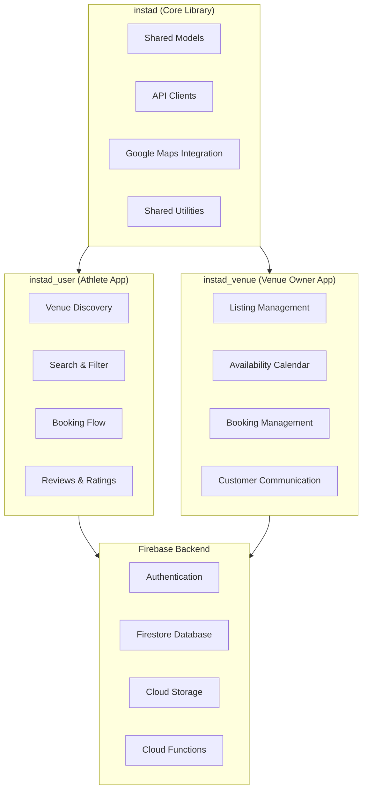

# Instad — Sports Venue Discovery & Booking Platform

A 3-app ecosystem for connecting athletes with sports venues. Users discover nearby courts and fields, venue owners manage their listings and bookings, and a shared core library handles the business logic and API integrations. Built with Flutter for iOS and Android.


## The Problem

Finding and booking sports venues is fragmented. Athletes search Google Maps, call venues, and hope for availability. Venue owners have no easy way to digitize their booking process. There's no platform that connects both sides.

## The Ecosystem



| Repo | Purpose | What it does |
|------|---------|-------------|
| **[instad](https://github.com/thisisyoussef/instad)** | Core library | Shared data models, API clients, Google Maps integration, utilities |
| **[instad_user](https://github.com/thisisyoussef/instad_user)** | Athlete-facing app | Venue discovery, map-based search, filtering, booking flow, reviews |
| **[instad_venue](https://github.com/thisisyoussef/instad_venue)** | Venue owner app | Listing CRUD, availability calendar, booking management, communication |

## Features

**User App (instad_user):**
- Map-based venue discovery with Google Maps SDK
- Filter by sport type, distance, amenities, price range, and availability
- Venue detail pages with photo galleries, reviews, and pricing
- Booking flow with time slot selection and confirmation

**Venue Owner App (instad_venue):**
- Create and manage venue listings with photos, descriptions, and amenity tags
- Availability calendar with time slot management
- View and manage incoming bookings
- Customer communication tools

## Technical Highlights

- **Shared Library Architecture** — The `instad` core library is a standalone Flutter package imported by both apps. This means data models, API clients, and map utilities are defined once and shared — no code duplication, guaranteed consistency between apps.
- **Google Maps Integration** — Custom map markers, real-time location tracking, distance calculations, and venue clustering for dense areas. The map layer handles both venue discovery (user app) and venue location setting (owner app).
- **Firebase Full-Stack** — Auth for both user types, Firestore for real-time data sync, Cloud Storage for venue photos, and Cloud Functions for server-side logic (booking confirmations, notifications).
- **Multi-App Monorepo Pattern** — Three separate repos with the core library as a git dependency. Each app can be built and deployed independently while sharing the same foundation.

## Tech Stack

| Layer | Technology |
|-------|-----------|
| Framework | Flutter (iOS + Android) |
| Language | Dart |
| Maps | Google Maps SDK |
| Backend | Firebase (Auth, Firestore, Storage, Functions) |
| Architecture | Shared core library + feature-specific apps |
| State | Provider |

## Running Locally

```bash
# Clone all three repos
git clone https://github.com/thisisyoussef/instad.git
git clone https://github.com/thisisyoussef/instad_user.git
git clone https://github.com/thisisyoussef/instad_venue.git

# Run the user app
cd instad_user
flutter pub get
flutter run
```

Requires a Google Maps API key and Firebase project configuration (google-services.json / GoogleService-Info.plist).
